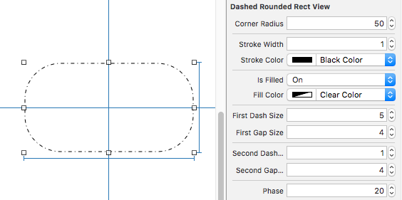

# MCDashedRoundedRectView

UIView with a dashed rounded rect outline; pattern of the dashes is adjusted to fit nicely.

## Motivation

Let me start by saying that dotted line is a very expressive thing. However thin, a regular line is still "there" – here it is, all solid and stable. Dotted line suggests ephemerality; perhaps, it's a glimpse of a parallel universe, a beckoning from things that are not yet there, a suggestion, an element not yet visible, a button not yet active...

Well, whatever it is, to be allowed near out pixel-perfect designs, it has to be precise and yet, with a standard *UIBezierPath.setLineDash()*, disappointing overlaps or gaps  exposing unsightly seams are almost guaranteed.

## Solution

I'll admit that all I needed was a perfectly dotted circle for an inactive button but, to make the project worthwhile and yet not totally consuming, I decided to extend it to a rounded rect – a common shape for a button with a circle as a subset.

What it is, it adjusts the sized od the dashes in the pattern to cover the path in question perfectly. Along the way I've noticed that *UIBezierPath(roundedRect: CGRect, cornerRadius: CGFloat)* overlaps slightly for some combinations of bounds sizes and corner radii – that's fixed too!

## Usage

Although all the values are adjustable in code, this component was designed to be used in Interface Builder. Here's a screenshot:

## Installation

Whether you use git sobmodules or jsut copy files, add files from the _Classes_ folder to your project.